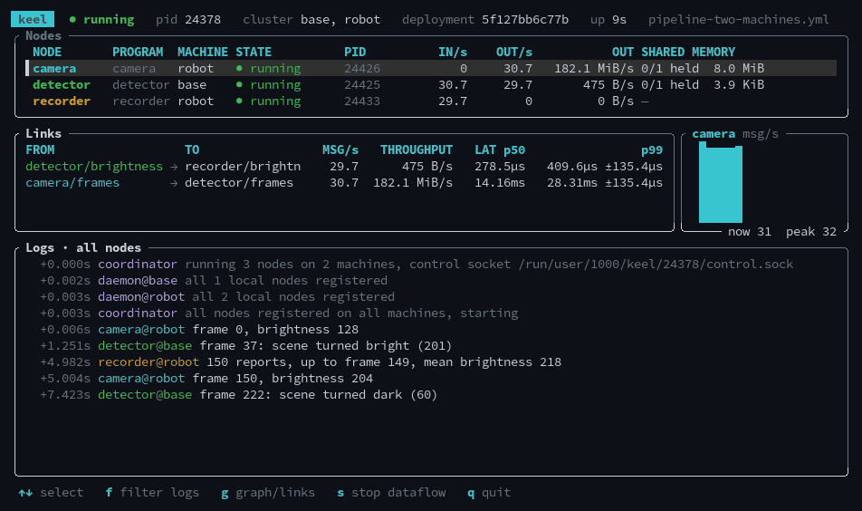

<h1 align="center">keel</h1>

<p align="center">
  <b>A whole robotics middleware stack in about 9,000 lines of Rust.</b><br>
  Zero-copy transport, real time, control, deployment, tracing and recording, built on what Linux already ships.
</p>

<p align="center">
  
  
  
</p>

<p align="center">
  
</p>

<p align="center">
  <a href="#the-stack">Stack</a> ·
  <a href="#try-it">Try it</a> ·
  <a href="#docs">Docs</a> ·
  <a href="#layout">Layout</a>
</p>

keel is a learning project: how does the whole stack of a robotics middleware
fit together, when each layer is the smallest thing that works? The design is
in [docs/architecture.md](docs/architecture.md), and every decision has a
[record](docs/decisions/).

- **5.6 µs** round trip between two nodes, **5 M msg/s**, zero-copy on a machine
- a control loop closed within its 1 ms cycle: **~20 µs** from state to
  command, **1.3 µs** spinning
- every message traced and stamped, across machines
- 6 direct dependencies; the rest is the kernel: shared memory, futexes,
  SCHED_FIFO, systemd, SSH, SocketCAN

## The stack

| Layer | What's in it | What you type | Docs |
|---|---|---|---|
| Provisioning | install over SSH, or a machine that is only keel; is it fit for a robot? | `keel provision` · `keel image` · `keel doctor` | [machines](docs/machines.md) |
| Deployment | builds named by hash, history, branches, fleets | `keel deploy` · `keel rollback` · `keel branch` · `keel fleet` | [deployment](docs/deployment.md) |
| Runtime | transport, lifecycle, real time, phases | `keel run` · `keel stop` · `keel update` | [dataflow](docs/dataflow.md) |
| Control | joints, controllers, CAN, simulation, lockstep, microcontrollers | `keel-pid` · `keel-sim` · `keel-can` | [control](docs/control.md) |
| Observability | tracing, recording, replay, a flight recorder | `keel top` · `keel trace` · `keel replay` | [observability](docs/observability.md) |

## Try it

```sh
cargo build
./target/debug/keel run examples/pipeline.yml    # runs until stopped
```

In another terminal:

```sh
./target/debug/keel top          # live view: ↑↓ select, f filter logs, g graph, s stop, q quit
./target/debug/keel trace        # where the time goes
./target/debug/keel stop         # graceful stop (so is Ctrl-C in the first terminal)
```

Then [examples/](examples/README.md): a control loop, a virtual CAN bus,
two machines, a fleet, a flight recorder, the benchmarks.

## Docs

| | |
|---|---|
| [architecture](docs/architecture.md) | the design, the milestones, the benchmarks |
| [dataflow](docs/dataflow.md) | the dataflow file, field by field, and the lifecycle |
| [machines](docs/machines.md) | provisioning, images, dataflows across machines, `keel doctor` |
| [deployment](docs/deployment.md) | builds, history, rollback, branches, fleets |
| [observability](docs/observability.md) | `keel top`, traces, recording, replay, the flight recorder |
| [control](docs/control.md) | joints and controllers, cycles, stamps, phases, writing a controller |
| [decisions](docs/decisions/) | one record per decision: context, choice, cost |

## Layout

```
crates/keel          node API: shared memory, channels, tracing, stamps, periodic loops
crates/keel-daemon   runs dataflows: sessions, coordinator, daemon, control API
crates/keel-cli      the `keel` command, including the `keel top` TUI
crates/keel-record   recordings: the file format and the recorder node
crates/keel-control  control above the node API: joint messages, cycles, a PID,
                     a simulated joint, joints on a CAN bus
crates/keel-micro    a node on a microcontroller: no_std, no allocation
crates/keel-serial   the node standing in for that chip on a serial port
examples/            dataflows and their nodes, benchmarks, containers, images
```

Lines of Rust that aren't blank or comments, at milestone 20:

| | lines |
|---|---:|
| `crates/keel` | 1503 |
| `crates/keel-daemon` | 4327 |
| `crates/keel-cli` | 1520 |
| `crates/keel-record` | 326 |
| `crates/keel-control` | 563 |
| `crates/keel-micro` | 143 |
| `crates/keel-serial` | 178 |
| `examples/` | 440 |
| **total** | **9000** |

Direct dependencies: `libc`, `serde`, `serde_json`, `serde_yaml`, and in the
CLI `clap` and `ratatui`. To count again:

```sh
find crates examples -name '*.rs' | xargs grep -cvHE '^\s*(//|$)' | awk -F: '{n += $2} END {print n}'
```
